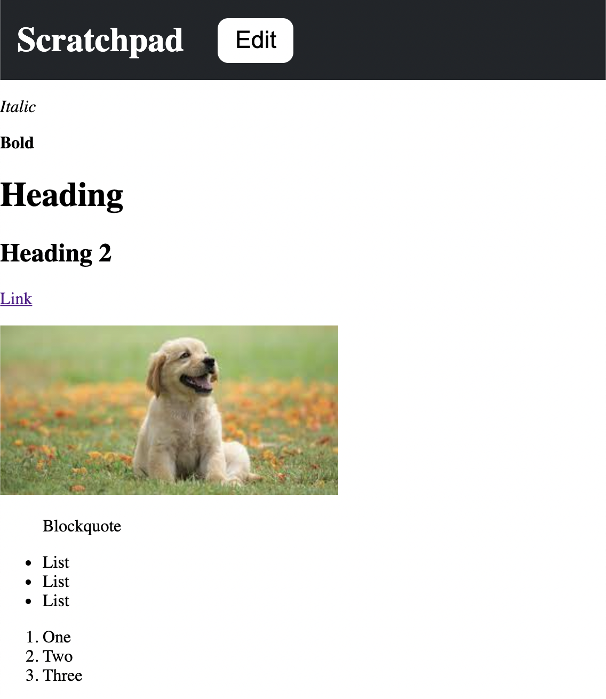

## Scratchpad Notes App

- [General info](#general-info)
- [Technologies](#technologies)
- [Setup](#setup)

## General info

This repository holds the source code for a scratchpad notes web app with markdown and browser persistence. Write notes with markdown and have it automatically saved locally.

## Technologies

Project is created with:

- React: 17.0.2
- [React Markdown](https://github.com/remarkjs/react-markdown): 7.0.1
- localStorage

## Setup

To run this project, install it locally using npm:

```
$ cd ./scratchpad-react
$ npm install
$ npm start
```

## Demo

The live demo is deployed on Netlify: https://neilsscratchpad.netlify.com/


